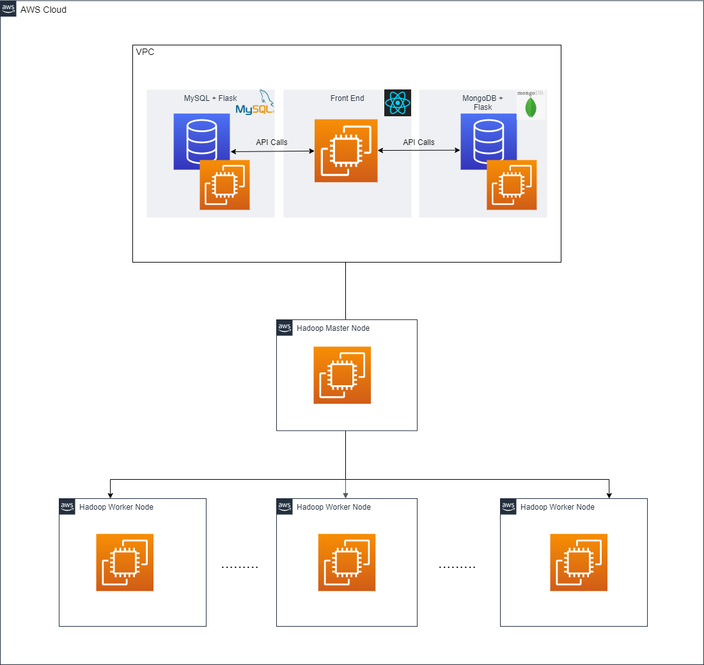
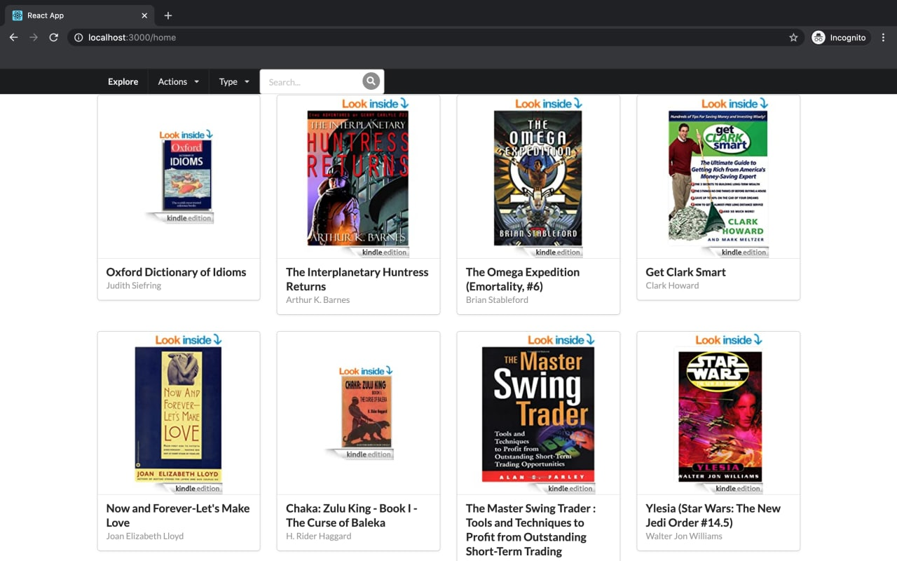
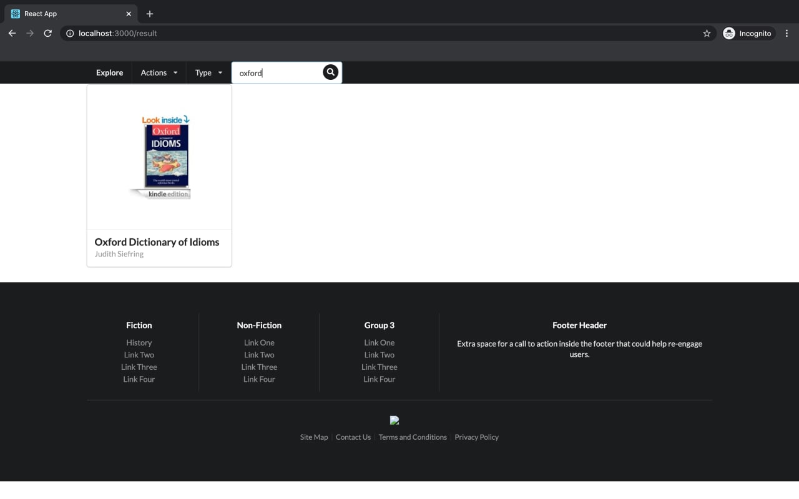
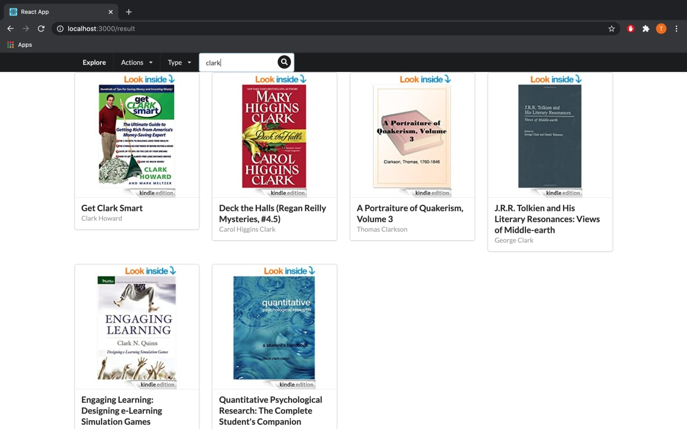
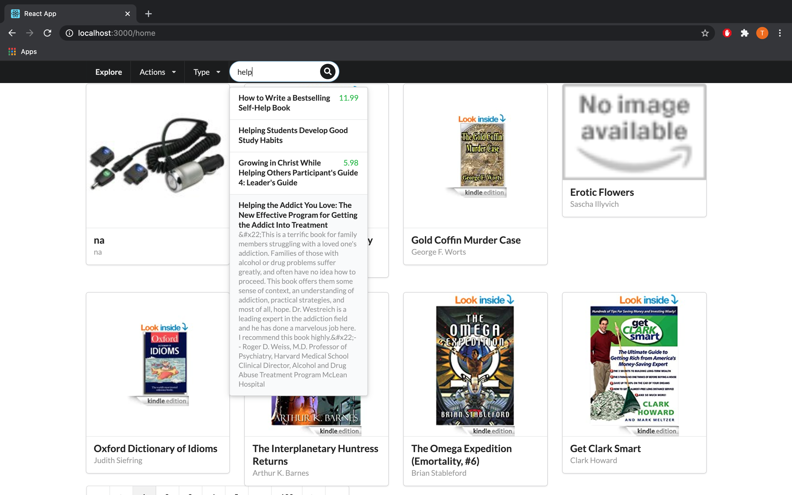
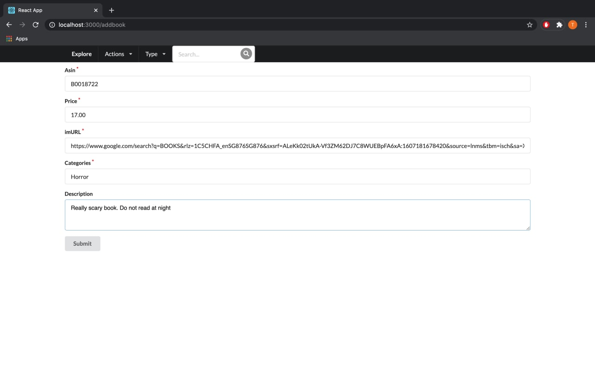
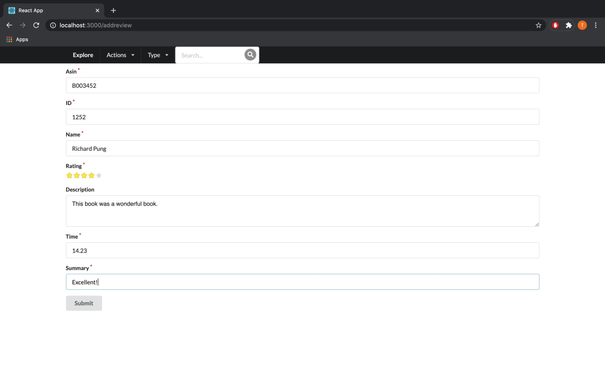

# 50.043 Database Project

As part of our 50.043 Database project, we created a web application for Kindle book reviews. We deployed our application using Flask with a MySQL and MongoDB databases. The MySQL database stores book reviews while the MongoDB stores logs as well as the metadata of books. Our group members consists of Lee Min Han, Nicholas Lee, Pung Tuck Wei, Noorbakht Khan and Dev Bahl.

## Table Of Contents:
- [Directory Structure](#Directory-Structure)
- [Systems Architecture](#Systems-Architecture)
- [Front-end Features](#Front-end-Features)
- [Analytics Tasks](#Analytics-Tasks)
- [Automation](#Automation)
- [API Documentation](#API-Documentation)

## Directory Structure:

```
.
├── Automation
│   ├── config.py              # Sets access_key, secret_access_key, session_token and region
│   ├── ec2_create.py          # Creates EC2 instances
│   ├── start.sh               # Bash script to start up EC2 instances
│   ├── teardown.py            # Tears down EC2 instances
├── analytics
│   ├── spark_app.py           # TFIDF and Pearson Correlation functions
├── books
│   ├── model.py               # Creates MySQL database model
│   ├── resource.py            # Creates MySQL endpoints
├── scripts
│   ├── load_reviews_ec2.sql   # Loads kindle_reviews into EC2
│   ├── load_reviews_local.sql # Loads kindle_reviews into localhost
├── .gitignore                 # To ignore pycache & ds_store in all folders
├── README.md                  
├── app.py                     # instantiate Flask for MySQL
├── author.py                  # Web scraping to update author and title values in mongoDB
├── db.py                      # instantiate SQLAlchemy
├── middleware_mongo.py        # Creates MongoDB endpoints
└── utils.py                   # Function for adding logs into mongoDB

```


## Systems Architecture




### API Methods
API Method | Route | Output
------ | ------ | ------
GET  | "{mysql_flask_ip}/review" | Get a review
POST  | "{mysql_flask_ip}/review" | Add a review
DELETE  | "{mysql_flask_ip}/review" | Delete a review
GET  | "{mysql_flask_ip}/reviews" | Gets reviews
DELETE | "{mysql_flask_ip}/reviews" | Delete reviews
GET  | "{mongo_flask_ip}/allbooks" | Get all books
GET  | "{mongo_flask_ip}/metadata/<asin>" | Get a book
POST | "{mongo_flask_ip}/bookPost" | Add a new book
GET  | "{mongo_flask_ip}/bookSearch" | Searching for a book based on title / author / category
DELETE  | "{mongo_flask_ip}/metadelete" | Delete a book

### For more information on API methods, look under [Appendix](#Appendix).

<br/><br/>

## Front-end Features

1. Search for an existing book by title
2. Search for an existing book by author
3. Adds a new book
4. Add a new review

### Screenshot of our Home/Explore Page:



Users are able to:
- View Book Covers
- View Book Title
- View Book Author
	- Done via web scraping script
	- Uses BeautifulSoup
- When a user clicks on a particular book, they are able to view the book reviews

### Actions:

#### 1. Search for an existing book by title:


#### 2. Search for an existing book by author:


- Search:
	- Search using Author
	- Search using Title
    - Done using regex to search for the exact string
    
#### 3. Dynamic Search with search Autocomplete:


- Search:
	- Search both using Author and Title
    - Done by creating and searching a MongoDB Text index which is much faster than regex

#### 4. Add a book:

- Add Book:
	- Asin
	- Price
	- Image URL
	- Categories
	- Description

#### 5. Add a review:

-	Add Review
	- Asin
	- ID
	- Name
	- Rating
	- Time
	- Summary


## Analytics Tasks

#### Requirements

Build an analytics system that performs the following :

- Correlation: Compute the Pearson correlation between price and average review length.
- TF-IDF: Compute the term frequency inverse document frequency metric on the review text. Treat one review as a document.

#### Approach

##### 1. Pearson Cofficient

**Pre-processing**

Inorder to retrieve length of `reviewText`, we join the meta data and reviews data dataframes based on `asin`, and compute a rdd containing `(price, reviewLength)`.

**Mapping Stage**

We mapped each row to its `x`, `x**2`, `xy`, `y` and `y**2` values respectively. Let x = price and y = average_reviewLength. This is done through:

```python
rdd.flatMap(map_fn_pearson)
```

**Reducing Stage**

Next, we reduceByKey and summed up all the values in each keys.

```python
rdd.reduceByKey(add)
```
Altogther, MapReduce gives us the rdd needed to compute Pearson Coefficient.

```python
def map_fn_pearson(pair):
    x, y = pair
    return [
        ("n", 1),
        ("xy", x * y),
        ("x", x),
        ("y", y),
        ("x_square", x ** 2),
        ("y_square", y ** 2)
    ]

def map_reduce_pearson(rdd):
    rdd = rdd.flatMap(map_fn_pearson)
    rdd = rdd.reduceByKey(add)
    return apply_pearson_formula(rdd.collect())

```

**Calculate Pearson Coefficient**

`apply_pearson_formula(result_list)` will then compute pearson coefficient based on the following formulae:
<p align="center">
  
</p>

After running the analytics script, we can find the results in the same directory as the spark_app.py file. We can find it by running this command: <br>
``` hdfs -l pearson_results.txt```

##### 2. TF-IDF

**a. Create Tokenizer: To convert each review into an array of words**

```python
tokenizer = ml.feature.Tokenizer(inputCol="reviewText", outputCol="token")
```

**b. Create CountVectorizer: To get term frequency vectors**

```python
cv = ml.feature.CountVectorizer(inputCol="token", outputCol="hash")
```

**c. Create idf: To get inverse document frequency**

```python
idf = ml.feature.IDF(inputCol="hash", outputCol="tfidf")
```

**d. Create Pipeline with Tokenizer, CountVectorizer& idf**

```python
pipeline = ml.Pipeline(stages=[tokenizer, cv, idf])
```

**e. Model fit & transform dataframe**

```python
model = pipeline.fit(df)
df = model.transform(df)
```
**f. Convert word index back into word**

To return tfidf score, we need to represent each word to its tfidf value. 
However, during CountVectorizer, each word is vectorized and indexed. Therefore, each word is represented by an integer index. 

In order, to recover the former, each word to its tfidf value, we need to:
1. Retrieve vocabulary from CountVectorizer stage
2. Form a dictionary of `{index, word}` (note: normal index)
3. Created a user-defined function udf and applied it to our dataframe.

```python

def sparse2dict(vec, idx2word):
    idxs = vec.indices
    vals = vec.values
    vals = vals.round(3)  
    return str({idx2word[i]:v for i,v in zip(idxs, vals)})

stages = model.stages
vectorizers = [s for s in stages if isinstance(s, CountVectorizerModel)]
vocab = [v.vocabulary for v in vectorizers]
vocab = vocab[0]
idx2word = {idx: word for idx, word in enumerate(vocab)}

my_udf_func = udf(lambda vector: sparse2dict(vector, idx2word), types.StringType())
df = df.select("reviewText", my_udf_func("tfidf").alias("tfidf_final"))
return df
```
After running the analytics scripts detailed in the next section, the results can be found in hdfs under the /results/ directory.

#### Analytics Result

**Pearson Coefficient Result**
```
+--------------------+
|            pearsonr|
+--------------------+
|0.005156601974564208|
+--------------------+
```

**TF-IDF Result**

```
+--------------------+--------------------+
|          reviewText|               tfidf|
+--------------------+--------------------+
|I enjoy vintage b...|{'the': 0.757, 'a...|
|This book is a re...|{'the': 0.606, 'a...|
|This was a fairly...|{'the': 0.454, 'a...|
|I'd never read an...|{'the': 0.151, 'i...|
|If you like perio...|{'the': 0.151, 'o...|
|A beautiful in-de...|{'the': 0.151, 'a...|
|I enjoyed this on...|{'the': 0.151, 'a...|
|Never heard of Am...|{'the': 0.606, 'a...|
|Darth Maul workin...|{'a': 0.26, 'of':...|
|This is a short s...|{'the': 0.606, 't...|
|I think I have th...|{'and': 0.223, 'a...|
|Title has nothing...|{'the': 0.303, 't...|
|Well written. Int...|{'to': 0.803, 'a'...|
|Troy Denning's no...|{'the': 3.785, 'a...|
|I am not for sure...|{'the': 0.908, 't...|
|I really enjoyed ...|{'the': 0.454, 'i...|
|Great read enjoye...|{'i': 0.288, 'of'...|
|Another well writ...|{'the': 0.151, 'a...|
|This one promises...|{'the': 0.151, 'a...|
|"I have a version...|{'the': 0.151, 'a...|
+--------------------+--------------------+
only showing top 20 rows
```

## Automation


## API Documentation

#### **Get A Review**

- **URL:**
  `/review/`

- **Method:**
  `GET`
- **URL Params**
  **Required:**
  `id=[String]`

- **Success Response:**

  - **Code:** 200 <br />
    **Content:** `{ "asin": "B000ZC8DPM", "helpful": "[0, 0]", "id": 1000, "overall": 5, "reviewText": "Stephanie Bond has become my new favorite author! She is really great at bringing a story together and keeping you hanging on to the end. I find it hard to put her books down once I start!", "reviewTime": "10 7, 2012", "reviewerID": "AR5WJIS4HEHNE", "reviewerName": "LittleByrd", "summary": "This is a really great book. Hillarious!", "unixReviewTime": 1349568000 }`

- **Error Response:**

  - **Code:** 404 <br />
    **Content:** `{"message": "There is no review with id 10003"}`

#### **Add A Review**

- **URL:**
  `/review/`

- **Method:**
  `POST`

- **Data Param:**

  `{ "asin": "B000ZC8DPM", "reviewText": "Stephanie Bond has become my new favorite author! She is really great at bringing a story together and keeping you hanging on to the end. I find it hard to put her books down once I start!", "reviewerID": "AR5WJIS4HEHNE", "reviewerName": "LittleByrd", "summary": "This is a really great book. Hillarious!" }`

- **Success Response:**

  - **Code:** 200 <br />
    **Content:** `{ "id": 982626, "asin": "B000ZC8DPM", "helpful": "[0, 0]", "overall": 0, "reviewText": "Stephanie Bond has become my new favorite author! She is really great at bringing a story together and keeping you hanging on to the end. I find it hard to put her books down once I start!", "reviewTime": "2020-11-21", "reviewerID": "AR5WJIS4HEHNE", "reviewerName": "LittleByrd", "summary": "This is a really great book. Hillarious!", "unixReviewTime": 1605890900 }`

- **Error Response:**

  - **Code:** 500 <br />
    **Content:** `{"message": "An error occurred when inserting review"}`

  OR

  - **Code:** 400 <br />
    **Content:** `{"message": {"asin": "This field cannot be left blank!"}}`

#### **Delete A Review**

- **URL:**
  `/review/`

- **Method:**
  `DELETE`
- **URL Params**
  **Required:**
  `id=[String]`

- **Success Response:**

  - **Code:** 200 <br />
    **Content:** `{"message": "Review of id 10003 deleted"}`

- **Error Response:**

  - **Code:** 404 <br />
    **Content:** `{"message": "There is no review with id 10003"}`

---

#### **Get Reviews**

- **URL:**
  `/reviews/`

- **Method:**
  `GET`
- **URL Params**
  **Required:**
  `asin=[String]`

- **Success Response:**

  - **Code:** 200 <br />
    **Content:** `[ { "asin": "B000ZC8DPM", "helpful": "[0, 0]", "id": 988, "overall": 5, "reviewText": "Love Stephanie Bond! Comical stories, keeps you wanting more. Can't wait for another one. Romance an clumsiness with a little calamity lol!", "reviewTime": "12 28, 2012", "reviewerID": "A3AU6XLPV4QUPB", "reviewerName": "Aissa", "summary": "Naughty or nice?", "unixReviewTime": 1356652800 }, . . ., { "asin": "B000ZC8DPM", "helpful": "[0, 0]", "id": 989, "overall": 3, "reviewText": "I tried this book because I wanted something light and happy for this Christmas season. I was very surprised to find it concerned an older hotel in San Francisco, one of my most favorite cities. The heroine was a strong woman and she meets a man who is ", "reviewTime": "12 20, 2013", "reviewerID": "A3BLREOY1EY3DC", "reviewerName": "Bama Girl", "summary": "Not yourUsual Christmas Story", "unixReviewTime": 1387497600 } ]`

- **Error Response:**

  - **Code:** 404 <br />
    **Content:** `{"message": "There are no reviews with asin B000ZC8DPMa"}`

#### **Delete Reviews**

- **URL:**
  `/reviews/`

- **Method:**
  `DELETE`
- **URL Params**
  **Required:**
  `asin=[String]`

- **Success Response:**

  - **Code:** 200 <br />
    **Content:** `{"message": "Review of asin B000FA64PA deleted"}`

- **Error Response:**

  - **Code:** 404 <br />
    **Content:** `{"message": "There are no reviews with asin B000FA64PA"}`

### **Get All Books**

- **URL:**
  `/allbooks`

- **Method:**
  `GET`

- **Success Response:**

  - **Code:** 200 <br />
    **Content:** `{ [{"_id": {"$oid": "5f89a3b947ad505b9ce7ee7e"}, "asin": "B000FA5SHK", "imUrl": "http://ecx.images-amazon.com/images/I/51c7mqORjsL._BO2,204,203,200_PIsitb-sticker-v3-big,TopRight,0,-55_SX278_SY278_PIkin4,BottomRight,1,22_AA300_SH20_OU01_.jpg", "categories": [["Books", "Science & Math", "Behavioral Sciences"], ["Books", "Self-Help", "Relationships", "Love & Romance"], ["Books", "Self-Help", "Sex"], ["Kindle Store", "Kindle eBooks", "Health, Fitness & Dieting", "Relationships", "Love & Romance"], ["Kindle Store", "Kindle eBooks", "Health, Fitness & Dieting", "Sex"]]}, . . ., {"_id": {"$oid": "5f89a3b947ad505b9ce7ee85"}, "asin": "B000FA5MQ2", "description": "PreTest&#174; is the medical student's most dynamic weapon for mastering the USMLE Step 2. *Designed to simulate the USMLE Step 2 *Reviewed by recently tested students *Mimics the real exam, question by question PreTest is the closest you can get to seeing the test before you take it. This one-of-a-kind test prep guide helps you: *Get to know material on the actual exam *Practice with 500 multiple-choice questions, many with clinical vignettes *Build confidence, skills, and knowledge *Learn key facts *Find references with every answer There are plenty of answers out there. But only PreTest&#174; delivers USMLE-type questions, in USMLE format. Open this PreTest for: *Format that simulates the exam *500 board-type questions *Referenced answers *Best prep there is for preventive medicine and public health questions on the USMLE Step 2 Great for course review and clinical rotations, too! Preventive Medicine and Public Health PreTest asks the right questions so you'll know the right answers. Open it and start learning what's on the test. &#x22;The annotated answers are a strength of this book&#8230;The types of questions in the manuscript parallel the format of those on the USMLE Step 2.&#x22; --a medical student who recently passed the USMLE Step 2", "price": 2.99, "imUrl": "http://ecx.images-amazon.com/images/I/41q97gzhKWL._BO2,204,203,200_PIsitb-sticker-v3-big,TopRight,0,-55_SX278_SY278_PIkin4,BottomRight,1,22_AA300_SH20_OU01_.jpg", "related": {"also_bought": ["B0054RFZGI", "B004M8SLRK", "B005OLBF3G", "B00B98WIOI", "B005H6VHMM", "B009Q0CS78", "B00EAR8UB0", "B00AN7MSPU", "B001VCD7V0"], "buy_after_viewing": ["B0054RFZGI"]}, "categories": [["Books", "Medical Books", "Medicine", "Internal Medicine", "Epidemiology"], ["Books", "Medical Books", "Medicine", "Preventive Medicine"], ["Books", "Medical Books", "Medicine", "Test Preparation & Review"], ["Kindle Store", "Kindle eBooks", "Professional & Technical", "Medical eBooks", "Administration & Policy", "Public Health"], ["Kindle Store", "Kindle eBooks", "Professional & Technical", "Medical eBooks", "Education & Training"], ["Kindle Store", "Kindle eBooks", "Professional & Technical", "Medical eBooks", "Internal Medicine", "Infectious Disease", "Epidemiology"], ["Kindle Store", "Kindle eBooks", "Professional & Technical", "Medical eBooks", "Specialties", "Preventive Medicine"]]}] }`

- **Error Response:**

  - **Code:** 404 <br />
    **Content:** ``

#### **Get A Book**

- **URL:**
  `/metadata/<asin>`

- **Method:**
  `GET`
- **URL Params**
  **Required:**
  `asin=[int]`

- **Success Response:**

  - **Code:** 201 <br />
    **Content:** `{ "data": "{'_id': ObjectId('5f89a3b947ad505b9ce7ee8f'), 'asin': 'B0002IQ15S', 'categories': [['Kindle Store', 'Kindle Accessories', 'Power Adapters', 'Kindle (1st Generation) Adapters']], 'description': \"This universal DC adapter powers/charges portable electronic devices such as mobile phones, handhelds/PDAs, digital cameras and MP3 players. Utilizing interchangeable itips, iGo AutoPower powers/charges virtually all of your portable electronic devices from any standard auto power outlet eliminating the need to carry multiple power adapters when you're mobile.Main FeaturesManufacturer: Mobility Electronics, IncManufacturer Part Number: PS0221-10Manufacturer Website Address: www.mobilityelectronics.comProduct Type: Power AdapterInput Voltage: 11.5 V DC to 16 V DCOutput Power: 15WWeight: 3.6 ozStandard Warranty: 2 Year(s) Limited\", 'title': 'Mobility IGO AUTOPOWER 3000 SERIES ( PS0221-10 )', 'price': 19.99, 'salesRank': {}, 'imUrl': 'http://ecx.images-amazon.com/images/I/21QFJM28NGL.jpg', 'related': {'also_viewed': ['B00511PS3C', 'B000PI17MM', 'B0016L6OWK', 'B006BGZJJ4', 'B005DOKHLK', 'B001W1XT6I', 'B003YLMAC8', 'B00EXIGQFS', 'B000QSPO3Y', 'B001W1TZTS', 'B00115PYGS', 'B001W1XT5O', 'B002GJQ7AU', 'B00EOE6COQ', 'B0012J52OC', 'B001007OUI', 'B00F3HH2HY', 'B00CGIVV5C', 'B00GA567M4', 'B002WCCQQA', 'B006GWO5NE', 'B006GWO5WK', 'B007HCCNJU', 'B00BHJRYYS'], 'buy_after_viewing': ['B006GWO5WK', 'B001N2LHHO', 'B006GWO5NE', 'B0012J52OC']}}", "message": "Book's metadata exists" }`

- **Error Response:**

  - **Code:** 404 <br />
    **Content:** `"data": {}, "message": "Book's metadata does not exists"`

#### **Add a new Book**

- **URL:**
  `/bookPost`

- **Method:**
  `POST`

- **URL Params**
  **Required:**
  `asin=[int] AND title=[String] AND price=[float] AND category=[String]`

- **Success Response:**

  - **Code:** 201 <br />
    **Content:** `{ "data": "<pymongo.results.InsertOneResult object at 0x000001F0AC92D280>", "message": "Book added" }`

- **Error Response:**

  - **Code:** 404 <br />
    **Content:** `"data": {}, "message": "Book exists. Please select another one!"`

#### **Searching for a book based on title / author / category**

- **URL:**
  `/bookSearch`

- **Method:**
  `GET`

- **URL Params**
  **Required:**
  `page=[int] AND EITHER title=[String] OR title=[String] OR category=[String]`

- **Success Response:**

  - **Code:** 201 <br />
    **Content:** `{"_id": {"$oid": "5f89a3b947ad505b9ce7ee8f"}, "asin": "B0002IQ15S", "categories": [["Kindle Store", "Kindle Accessories", "Power Adapters", "Kindle (1st Generation) Adapters"]], "description": "This universal DC adapter powers/charges portable electronic devices such as mobile phones, handhelds/PDAs, digital cameras and MP3 players. Utilizing interchangeable itips, iGo AutoPower powers/charges virtually all of your portable electronic devices from any standard auto power outlet eliminating the need to carry multiple power adapters when you're mobile.Main FeaturesManufacturer: Mobility Electronics, IncManufacturer Part Number: PS0221-10Manufacturer Website Address: www.mobilityelectronics.comProduct Type: Power AdapterInput Voltage: 11.5 V DC to 16 V DCOutput Power: 15WWeight: 3.6 ozStandard Warranty: 2 Year(s) Limited", "title": "Mobility IGO AUTOPOWER 3000 SERIES ( PS0221-10 )", "price": 19.99, "salesRank": {}, "imUrl": "http://ecx.images-amazon.com/images/I/21QFJM28NGL.jpg", "related": {"also_viewed": ["B00511PS3C", "B000PI17MM", "B0016L6OWK", "B006BGZJJ4", "B005DOKHLK", "B001W1XT6I", "B003YLMAC8", "B00EXIGQFS", "B000QSPO3Y", "B001W1TZTS", "B00115PYGS", "B001W1XT5O", "B002GJQ7AU", "B00EOE6COQ", "B0012J52OC", "B001007OUI", "B00F3HH2HY", "B00CGIVV5C", "B00GA567M4", "B002WCCQQA", "B006GWO5NE", "B006GWO5WK", "B007HCCNJU", "B00BHJRYYS"], "buy_after_viewing": ["B006GWO5WK", "B001N2LHHO", "B006GWO5NE", "B0012J52OC"]}}`

- **Error Response:**

  - **Code:** 404 <br />
    **Content:** `{"message": "Book does not exists!", "data": {}}`

#### **Deleting a book**

- **URL:**
  `/metadelete/<asin>`

- **Method:**
  `DELETE`

- **URL Params**
  **Required:**
  `asin=[int]`

- **Success Response:**

  - **Code:** 201 <br />
    **Content:** `"data": "{'_id': ObjectId('5f983bd4b54d69d3727654b9'), 'asin': 'B000FA5NS3434', 'description': 'TestTestsda', 'price': 100}", "message": "Deleted metadata of book"`

- **Error Response:**

  - **Code:** 404 <br />
    **Content:** `"data": {}, "message": "Book does not exist so cannot delete metadata"`

